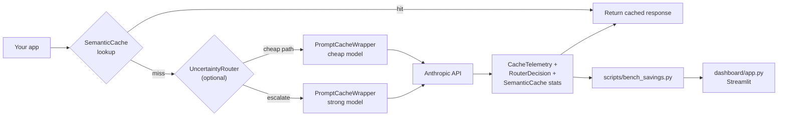
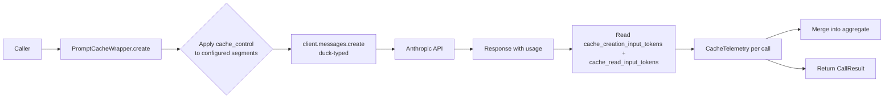
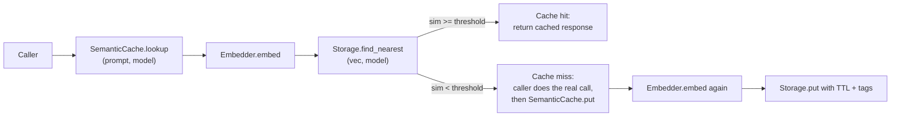
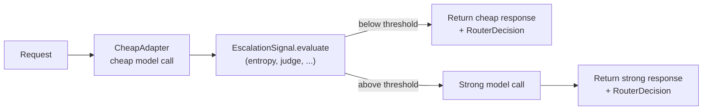
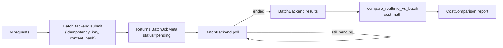
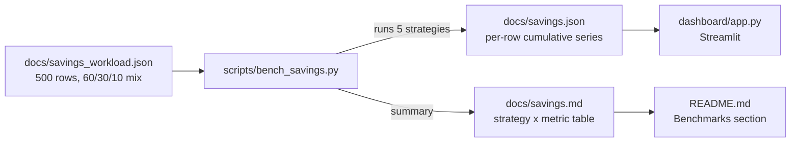
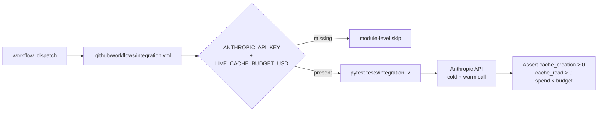

# Architecture

The toolkit is organized as a set of independent layers. Each layer is
adoptable on its own; you don't pay for what you don't use. Five layers
ship today plus a live-API integration posture. The first half of this
doc is the integrated picture — how the layers compose at runtime — and
the second half is the per-layer detail with the design decisions behind
each one.

## Integrated runtime flow

The natural request lifecycle when all four runtime layers are stacked:

`BatchAPIBackend` is the offline sibling — for workloads tolerant of
~24h latency it replaces the realtime path entirely (see §4). The
realtime stack and the batch stack don't mix in a single request; they
mix in the same *workload* by routing some rows to one and some to the
other.

**Stack-level invariants.**

- The package is dep-free at import. The Anthropic SDK is never
  imported; clients are duck-typed against `client.messages.create(...)`
  (D-002 posture, applied consistently across every layer).
- Optional integrations (`redis`, `streamlit`, `dashboard`) live behind
  PEP 621 extras so the core stays installable in restricted CI sandboxes.
- Pricing math (`cost_optimizer/pricing.py`) is the single source of
  truth for `dollars_saved` on every layer. No fabricated rates;
  unknown models raise `UnknownModelError` rather than guessing.
- Every layer is independently testable in CI without an API key. The
  *live*-API path is gated by `tests/integration/` + `workflow_dispatch`
  (§7).

---

## 1. Prompt-cache wrapper

**What it does.** Wraps `client.messages.create(...)` to inject
`cache_control: {"type": "ephemeral"}` on caller-chosen segments
(`system`, `tools`, `messages_prefix`), reads cache-usage fields off
the response, and rolls them into a `CacheTelemetry` struct (`hits`,
`misses`, `tokens_cached`, `tokens_written`, `dollars_saved`) per call
and aggregated across the wrapper's lifetime.

**What it costs.** One wrapper call per API call. No persistent state
besides the in-process aggregate. The first call to a new prefix pays
the 1.25× write multiplier; subsequent calls within the cache TTL pay
the 0.10× read multiplier. Worked savings: 84% on the synthetic
500-row workload (`docs/savings.md`).

**Composes with.** Any other layer — this is the bottom of the
runtime stack and almost everything else flows through it.

**Why these decisions.**

- Client is duck-typed (D-002), not an Anthropic SDK import. Makes the
  package importable in environments without an API key and testable
  with a fake client.
- Pricing is a small in-repo table (`cost_optimizer/pricing.py`),
  updated by hand from Anthropic's published rates, including the
  cache write/read multipliers (1.25× / 0.10×). Never fabricated.
- `CacheTelemetry.to_dict()` and `PromptCacheWrapper.dump_aggregate_json(path)`
  (#50) ship the observability shape: a stable JSON dict with all five
  telemetry fields (`hits`, `misses`, `tokens_cached`, `tokens_written`,
  `dollars_saved`) written atomically through the package-level
  `atomic_write_text` helper at `cost_optimizer/io_utils.py`.
  `scripts/_io.py` remains as a backwards-compat re-export of the
  helper for `scripts/bench_savings.py` and `scripts/tune_threshold.py`.

---

## 2. Semantic response cache

**What it does.** Embedding-keyed near-duplicate cache that sits in
front of the wrapper. Two paraphrased prompts ("how do I refund a
charge?" and "I need a refund — how?") hit the same entry; a new
model call only happens when the request is genuinely novel.

**What it costs.** One embedding call per lookup (HashEmbedder is
dep-free and free; BYO embedders incur their own per-call cost). One
storage round-trip. Worked savings: 56% on the same 500-row workload
when ~60% of rows are redundant.

**Composes with.** Sits in front of `PromptCacheWrapper`. On a miss,
the caller routes through the wrapper (or the router) and writes the
response back into the cache.

**Why these decisions.**

- **D-004.** Two pluggable Protocols (`Embedder`, `Storage`),
  consistent with the portfolio's pattern (rag-production-kit reranker,
  llm-eval-harness Judge backend). Dep-free defaults
  (`HashEmbedder`, `InMemoryStorage`); production callers BYO via
  Protocol. Redis support is lazy-imported behind the `[redis]` extra.
- **D-005.** Cache keys include `model_id`. Same prompt to two
  models is two separate entries — otherwise a Haiku response could
  be served to an Opus caller, which is a quality bug, not a cost win.
- **D-006.** Default `similarity_threshold = 0.95` — high on
  purpose. False positives are user-visible bugs; false negatives are
  just cache misses. Operators dial it down when their workload's
  false-positive rate allows it.
- **D-007.** False-positive rate is measured offline via
  `measure_false_positive_rate()`, not online via random sampling.
  Online sampling silently bleeds savings; offline measurement is an
  operator-initiated cost.
- **CacheStats observability (#52).** `CacheStats.to_dict()` and
  `SemanticCache.dump_stats_json(path)` ship the same observability
  shape the prompt-cache wrapper layer exposes (#50): a stable JSON
  dict with the four raw counters (`hits`, `misses`, `invalidations`,
  `expired_purged`) plus the two derived properties (`total_lookups`,
  `hit_rate`). Written atomically through `cost_optimizer/io_utils.py`
  so the two cache layers expose one observability shape to operators
  tailing the files or scraping the dicts.

---

## 3. Uncertainty-routed model fallback

**What it does.** A cheap-by-default router that escalates to a
stronger model only when an uncertainty signal says the cheap model
isn't confident. Ships two signals: `EntropySignal` (Shannon entropy
over first-token logprobs from the cheap response) and
`JudgeConfidenceSignal` (delegates to `llm-eval-harness`'s `Judge`).

**What it costs.** One extra signal evaluation per cheap response. On
the synthetic workload escalation rate was 10% (50/500); cost is
*higher* than baseline (-155%) by design — the router buys quality,
not dollars. Mean quality on that workload went from 0.886 → 0.921.

**Composes with.** Sits *after* the semantic cache and *in front of*
the prompt-cache wrapper. Cache hits skip the router entirely. Cache
misses go through the router; both cheap and escalated paths flow
through their own `PromptCacheWrapper` (or none).

**Why these decisions.**

- **D-008.** `EscalationSignal` is a single-method Protocol — same
  shape as `Embedder`, `Storage`, and llm-eval-harness's `Backend`.
  Consumers BYO signals without inheritance or registration overhead.
- **D-009.** `RouterDecision` returns the dataclass, not a model-id
  string. Signal values are telemetry; the savings dashboard needs
  per-signal cost attribution. First-trip-wins for the model choice
  but every signal is still measured for the dashboard.
- **D-007 (mirrored).** `scripts/tune_threshold.py` runs in `dry`
  mode with a 5-row canned dataset; real-API threshold tuning is
  explicitly an operator step, not a CI step, to avoid silent
  per-row API spend on every test run.

---

## 4. Batch API integration

**What it does.** Submits a list of requests to Anthropic's Message
Batches endpoint, polls until done, returns results. Ships an
in-memory backend for tests + an Anthropic-SDK-duck-typed backend for
production. Yields a documented batch-discount factor (0.5×) in the
`compare_realtime_vs_batch` cost report.

**What it costs.** Up to ~24h of latency (Anthropic's stated
batch SLA) in exchange for the 50% discount. Worked savings: 50% on
the same workload (the discount is the discount).

**Composes with.** Replaces the realtime stack for batch-tolerant
workloads. Tools like the savings dashboard treat realtime and batch
as separate workload modes — they don't mix in a single request.

**Why these decisions.**

- **D-002 (extended).** `AnthropicBatchBackend` takes a
  pre-constructed Anthropic client; the layer never imports the SDK.
  Surface is duck-typed against `client.messages.batches.*`.
- **D-010.** Idempotency = caller key **plus** content hash (request
  count, custom ids, prompts, model, max_tokens, system, order-sensitive).
  Same payload + same key → returns the existing job id (retry-safe).
  Different payload + same key → raises `IdempotencyConflict` (loud
  failure beats silent double-charging).
- **D-003 (extended).** `compare_realtime_vs_batch` requires caller
  to supply prices — no defaults shipped. Multi-model workloads
  pass `model_of=lambda req: req.model`.

---

## 5. Savings dashboard + bench harness

**What it does.** A hermetic 500-row synthetic workload runner
(`scripts/bench_savings.py`) and an optional Streamlit dashboard
(`dashboard/app.py`) that reads the bench artifacts. Five strategies
compared: baseline, prompt-cache, semantic-cache, router, batch. Real
pricing table, real cumulative-savings-per-row series.

**What it costs.** Zero API spend in default mode — the bench is
deterministic and dep-free (no Anthropic calls). An operator-initiated
real-API mode is intentionally unimplemented (same posture as
`tune_threshold.py`).

**Composes with.** Reads the same `cost_optimizer.pricing` table as
the runtime layers, so README numbers and dashboard numbers can never
drift apart.

**Why these decisions.**

- **D-011.** Dashboard is Streamlit behind a `[dashboard]` extra.
  Mirrors the Redis pattern (D-004). The core package stays dep-free;
  dashboard does no recomputation — file on disk is the source of
  truth so table and dashboard never drift.
- **D-012.** Bench workload is synthetic with a documented 60/30/10
  split (`redundant` / `easy` / `hard`), not an HF dataset slice. CI
  proves the plumbing and the math; an operator runs against real
  data and commits `docs/savings_real.md`. Same posture as
  `tune_threshold.py` — no fabricated benchmarks (handoff §10).

---

## 6. Live-API integration test posture

**What it does.** `tests/integration/test_live_cache.py` exercises
`PromptCacheWrapper` against the real Anthropic API to confirm a cold
call writes cache tokens and a warm call reads them — the math the
unit tests stub. The suite is gated on `ANTHROPIC_API_KEY` plus a
`LIVE_CACHE_BUDGET_USD` guardrail (default `$0.10`).

**What it costs.** ≤ `$LIVE_CACHE_BUDGET_USD` per CI run. Default
`pytest` invocation skips this suite — it runs only on a manual
`workflow_dispatch` against the `integration` workflow, never on
push or PR.

**Composes with.** Doesn't compose at runtime — it's a CI posture.
Catches the regression where unit tests pass but the real cache
header isn't being parsed correctly.

**Why this gating?** Not a tradeoff worth a D-NNN entry — the rule
is just "live API tests are budget-bounded and operator-triggered."
The pattern is reused across the portfolio (rag-production-kit,
llm-eval-harness).

---

## Where to look next

- **Per-layer code** — `cost_optimizer/{cache_wrapper,semantic_cache,router,batch}.py`.
- **Pricing table** — `cost_optimizer/pricing.py`. Update when
  Anthropic publishes new rates.
- **Bench harness** — `scripts/bench_savings.py`; workload at
  `docs/savings_workload.json`.
- **Dashboard** — `dashboard/app.py`; reads `docs/savings.json`.
- **Design decisions** — `MEMORY/core_decisions_human.md` for prose,
  `MEMORY/core_decisions_ai.md` for the structured log.
