# Architecture

The toolkit is organized as a small set of independent layers. Each layer is
adoptable on its own; you don't pay for what you don't use. The shipped layer
(as of issue #1) is the **prompt-caching wrapper**; the others are scheduled.

## Prompt-caching wrapper (shipped)

```mermaid
flowchart LR
    A[Your app] --> B[PromptCacheWrapper.create&#40;...&#41;]
    B --> C{apply cache_control<br/>to configured segments}
    C --> D[client.messages.create&#40;...&#41;<br/>duck-typed Anthropic-like]
    D --> E[Anthropic API]
    E --> F[response with usage]
    F --> G[read cache_creation_input_tokens<br/>+ cache_read_input_tokens]
    G --> H[CacheTelemetry per call]
    H --> I[merge into aggregate]
    H --> J[return CallResult to caller]
```

**Boundaries.** The wrapper depends only on the Python stdlib. The
Anthropic SDK is never imported; clients are duck-typed against
`client.messages.create(...)`. This makes the wrapper importable in
environments without an API key and testable with a hand-rolled fake
client (see `tests/test_cache_wrapper.py`).

**Pricing.** Per-model input rates and Anthropic's cache multipliers
(write 1.25×, read 0.10×) live in `cost_optimizer/pricing.py`. The table
is small and updated by hand from Anthropic's published pricing — never
fabricated. Unknown models raise `UnknownModelError` rather than guessing.

## Planned layers

- **Semantic response cache** (issue #2) — embedding-based exact/near-duplicate
  cache with TTL and invalidation, sits in front of `PromptCacheWrapper`.
- **Uncertainty-routed model fallback** (issue #3) — cheap model handles the
  majority, escalates to a strong model on uncertainty signals (logprob entropy,
  judge confidence).
- **Batch API integration** — for workloads tolerant of 24h latency.
- **Savings dashboard** — aggregates telemetry across all wrappers in process.
