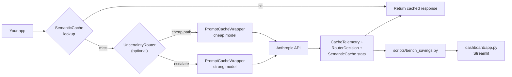
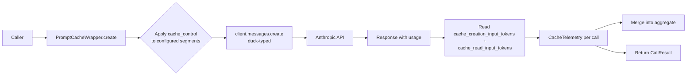
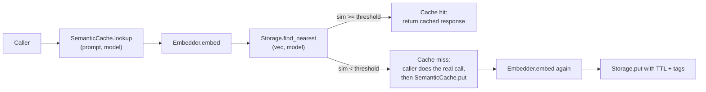
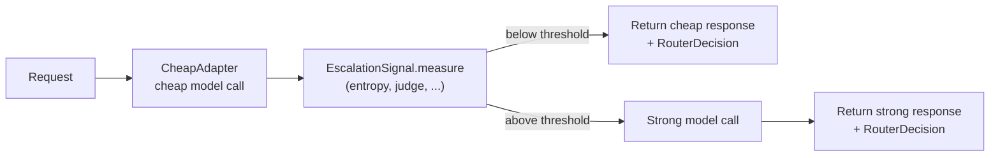
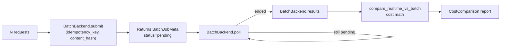
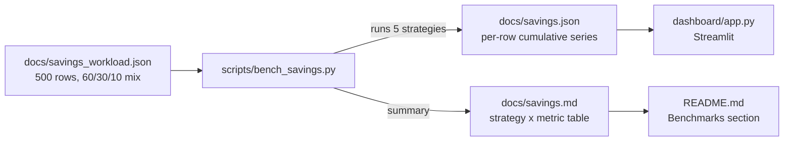
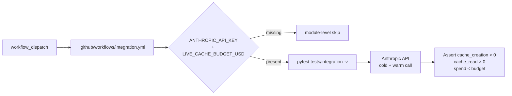

# Architecture

The toolkit is organized as a set of independent layers. Each layer is
adoptable on its own; you don't pay for what you don't use. Five layers
ship today plus a live-API integration posture. The first half of this
doc is the integrated picture — how the layers compose at runtime — and
the second half is the per-layer detail with the design decisions behind
each one.

## Integrated runtime flow

The natural request lifecycle when all four runtime layers are stacked:

```mermaid
flowchart LR
    APP[Your app] --> SC{SemanticCache<br/>lookup}
    SC -- hit --> RESP[Return cached response]
    SC -- miss --> RT{"UncertaintyRouter<br/>(optional)"}
    RT -- cheap path --> PCW[PromptCacheWrapper<br/>cheap model]
    RT -- escalate --> PCW2[PromptCacheWrapper<br/>strong model]
    PCW --> API[Anthropic API]
    PCW2 --> API
    API --> TEL[CacheTelemetry +<br/>RouterDecision +<br/>SemanticCache stats]
    TEL --> RESP
    TEL --> BENCH[scripts/bench_savings.py]
    BENCH --> DASH[dashboard/app.py<br/>Streamlit]
```

`AnthropicBatchBackend` is the offline sibling — for workloads tolerant of
~24h latency it replaces the realtime path entirely (see §4). The
realtime stack and the batch stack don't mix in a single request; they
mix in the same *workload* by routing some rows to one and some to the
other.

**Stack-level invariants.**

- The package is dep-free at import. The Anthropic SDK is never
  imported; clients are duck-typed against `client.messages.create(...)`
  (D-002 posture, applied consistently across every layer).
- Optional integrations (`redis`, `streamlit`, `dashboard`) live behind
  PEP 621 extras so the core stays installable in restricted CI sandboxes.
- Pricing math (`cost_optimizer/pricing.py`) is the single source of
  truth for the savings figures on every layer. No fabricated rates;
  unknown models raise `UnknownModelError` rather than guessing. A field
  that table declares and validates is a field some layer must read — the
  write multiplier sat validated and unread on the runtime path for a while
  (#196).
- Every layer is independently testable in CI without an API key. The
  *live*-API path is gated by `tests/integration/` + `workflow_dispatch`
  (§7).

---

## 1. Prompt-cache wrapper

**What it does.** Wraps `client.messages.create(...)` to inject
`cache_control: {"type": "ephemeral"}` on caller-chosen segments
(`system`, `tools`, `messages_prefix`), reads cache-usage fields off
the response, and rolls them into a `CacheTelemetry` struct (`hits`,
`misses`, `tokens_cached`, `tokens_written`, `dollars_saved`,
`dollars_write_premium`, and the derived `net_dollars_saved`) per call
and aggregated across the wrapper's lifetime.

**Both sides of the trade are priced (#196).** For a while only one was.
`ModelPricing` declares, documents, defaults and validates
`cache_write_multiplier = 1.25` — guarded for sign, finiteness, `bool`-ness
and type across #71, #142 and #158 — and `scripts/bench_savings.py` was the
only reader. The runtime wrapper charged the 0.10× read discount and not the
1.25× write surcharge, so the number the README quickstart printed and the
number the savings dashboard showed came from two different cost models over
one pricing table. Measured on `claude-opus-4-8` with a 20k-token prefix, a
stream of 8 writes and 2 reads reported **+$0.18 saved** on a run the bench
prices at **−$0.02** — a sign flip, and a structural one: `dollars_saved` is
reads times a positive discount, so it could not express a loss at all.

The fix is additive, not a redefinition. `dollars_saved` keeps its exact
meaning and value (gross read-side savings) so nothing reading it changes;
`dollars_write_premium` carries `tokens_written × rate × (multiplier − 1)`,
and `net_dollars_saved` is the difference — a derived property, so it cannot
drift from its inputs across `merge`. That expression is algebraically
identical to `_run_prompt_cache`'s, and
`tests/test_cache_wrapper_net_savings.py` drives the real bench functions and
asserts equality over a table of streams rather than restating the arithmetic.
There is deliberately no `max(0.0, ...)` on the premium: the multiplier is
validated `>= 0.0`, not `>= 1.0`, and a sub-1.0 value means writing is
genuinely cheaper than not caching.

**What it costs.** One wrapper call per API call. No persistent state
besides the in-process aggregate. The first call to a new prefix pays
the 1.25× write multiplier; subsequent calls within the cache TTL pay
the 0.10× read multiplier. Worked savings: 84% on the synthetic
500-row workload (`docs/savings.md`).

```mermaid
flowchart LR
    A[Caller] --> W[PromptCacheWrapper.create]
    W --> CT{Apply cache_control<br/>to configured segments}
    CT --> M[client.messages.create<br/>duck-typed]
    M --> API[Anthropic API]
    API --> R[Response with usage]
    R --> TT[Read cache_creation_input_tokens +<br/>cache_read_input_tokens]
    TT --> TEL[CacheTelemetry per call]
    TEL --> AGG[Merge into aggregate]
    TEL --> RES[Return CallResult]
```

**Composes with.** Any other layer — this is the bottom of the
runtime stack and almost everything else flows through it.

**Why these decisions.**

- Client is duck-typed (D-002), not an Anthropic SDK import. Makes the
  package importable in environments without an API key and testable
  with a fake client.
- Pricing is a small in-repo table (`cost_optimizer/pricing.py`),
  updated by hand from Anthropic's published rates, including the
  cache write/read multipliers (1.25× / 0.10×). Never fabricated.
- `CacheTelemetry.to_dict()` and `PromptCacheWrapper.dump_aggregate_json(path)`
  (#50) ship the observability shape: a stable JSON dict with every
  telemetry field (`hits`, `misses`, `tokens_cached`, `tokens_written`,
  `dollars_saved`, `dollars_write_premium`) plus the derived
  `net_dollars_saved` — emitted even though it is not a dataclass field,
  because the payload carries no rate, so before #196 a sink holding the
  benefit in dollars and the cost in tokens could not convert between them —
  written atomically through the package-level
  `atomic_write_text` helper at `cost_optimizer/io_utils.py`.
  `scripts/_io.py` remains as a backwards-compat re-export of the
  helper for `scripts/bench_savings.py` and `scripts/tune_threshold.py`.

---

## 2. Semantic response cache

**What it does.** Embedding-keyed near-duplicate cache that sits in
front of the wrapper. Two paraphrased prompts ("how do I refund a
charge?" and "I need a refund — how?") hit the same entry; a new
model call only happens when the request is genuinely novel.

**What it costs.** One embedding call per lookup (HashEmbedder is
dep-free and free; BYO embedders incur their own per-call cost). One
storage round-trip. Worked savings: 56% on the same 500-row workload
when ~60% of rows are redundant.

```mermaid
flowchart LR
    Q[Caller] --> L["SemanticCache.lookup<br/>(prompt, model)"]
    L --> EM[Embedder.embed]
    EM --> ST["Storage.find_nearest<br/>(vec, model)"]
    ST -- sim >= threshold --> H[Cache hit:<br/>return cached response]
    ST -- sim < threshold --> X[Cache miss:<br/>caller does the real call,<br/>then SemanticCache.put]
    X --> EMP[Embedder.embed again]
    EMP --> STP[Storage.put with TTL + tags]
```

**Composes with.** Sits in front of `PromptCacheWrapper`. On a miss,
the caller routes through the wrapper (or the router) and writes the
response back into the cache.

**Why these decisions.**

- **D-004.** Two pluggable Protocols (`Embedder`, `Storage`),
  consistent with the portfolio's pattern (rag-production-kit reranker,
  llm-eval-harness Judge backend). Dep-free defaults
  (`HashEmbedder`, `InMemoryStorage`); production callers BYO via
  Protocol. Redis support is lazy-imported behind the `[redis]` extra.
  Pluggability implies a **payload contract** (**D-015**): a `SemanticCache.put`
  payload must survive a JSON round-trip unchanged (`str`, `int`,
  `float`, `bool`, `None`, `list`, `dict` with string keys), because a
  persistent backend has to serialize it. Those are *exact* types, not
  base classes: `json.dumps` writes a subclass as its base, so an
  int-valued enum member, a `defaultdict` or a `Counter` diverges the
  same way a `tuple` does, and the validator classifies on `type(...)`
  rather than `isinstance` for that reason (#207). Enforced at the `put` seam by
  `_validate_payload`, not at whichever backend happens to be
  configured — otherwise `InMemoryStorage` (which `deepcopy`s) and
  `RedisStorage` (which `json.dumps`) serve different objects for the
  same record, and code written against the dep-free default breaks on
  the swap this decision exists to make easy.
- **D-005.** Cache keys include `model_id`. Same prompt to two
  models is two separate entries — otherwise a Haiku response could
  be served to an Opus caller, which is a quality bug, not a cost win.
- **D-006.** Default `similarity_threshold = 0.95` — high on
  purpose. False positives are user-visible bugs; false negatives are
  just cache misses. Operators dial it down when their workload's
  false-positive rate allows it.
- **D-007.** False-positive rate is measured offline via
  `measure_false_positive_rate()`, not online via random sampling.
  Online sampling silently bleeds savings; offline measurement is an
  operator-initiated cost.
- **CacheStats observability (#52).** `CacheStats.to_dict()` and
  `SemanticCache.dump_stats_json(path)` ship the same observability
  shape the prompt-cache wrapper layer exposes (#50): a stable JSON
  dict with the four raw counters (`hits`, `misses`, `invalidations`,
  `expired_purged`) plus the two derived properties (`total_lookups`,
  `hit_rate`). Written atomically through `cost_optimizer/io_utils.py`
  so the two cache layers expose one observability shape to operators
  tailing the files or scraping the dicts.

---

## 3. Uncertainty-routed model fallback

**What it does.** A cheap-by-default router that escalates to a
stronger model only when an uncertainty signal says the cheap model
isn't confident. Ships two signals: `EntropySignal` (Shannon entropy
over first-token logprobs from the cheap response) and
`JudgeConfidenceSignal` (delegates to `llm-eval-harness`'s `Judge`).

**What it costs.** One extra signal evaluation per cheap response. On
the synthetic workload escalation rate was 10% (50/500); cost is
*higher* than baseline (-155%) by design — the router buys quality,
not dollars. Mean quality on that workload went from 0.886 → 0.921.

```mermaid
flowchart LR
    REQ[Request] --> CHEAP[CheapAdapter<br/>cheap model call]
    CHEAP --> SIG["EscalationSignal.measure<br/>(entropy, judge, ...)"]
    SIG -- below threshold --> RET[Return cheap response<br/>+ RouterDecision]
    SIG -- above threshold --> ESC[Strong model call]
    ESC --> RET2[Return strong response<br/>+ RouterDecision]
```

**Composes with.** Sits *after* the semantic cache and *in front of*
the prompt-cache wrapper. Cache hits skip the router entirely. Cache
misses go through the router; both cheap and escalated paths flow
through their own `PromptCacheWrapper` (or none).

**Why these decisions.**

- **D-008.** `EscalationSignal` is a single-method Protocol — same
  shape as `Embedder`, `Storage`, and llm-eval-harness's `Backend`.
  Consumers BYO signals without inheritance or registration overhead.
- **D-009.** `RouterDecision` returns the dataclass, not a model-id
  string. Signal values are telemetry; the savings dashboard needs
  per-signal cost attribution. First-trip-wins for the model choice
  but every signal is still measured for the dashboard.
- **D-007 (mirrored).** `scripts/tune_threshold.py` runs in `dry`
  mode with a 5-row canned dataset; real-API threshold tuning is
  explicitly an operator step, not a CI step, to avoid silent
  per-row API spend on every test run.
- **RouterStats observability (#62).** `RouterStats.to_dict()` and
  `UncertaintyRouter.dump_stats_json(path)` ship the same observability
  shape the two cache layers expose (#50 / #52): a stable JSON dict
  with the three raw counters (`total_routes`, `escalations`,
  `cheap_only`), three per-signal breakdowns (`per_signal_trips` for
  first-trip-wins attribution, `per_signal_measured` for the
  didn't-trip vs. couldn't-measure distinction, and `per_signal_errors`
  (#184) for the couldn't-measure vs. *is broken* distinction — a
  signal that abstains by raising is indistinguishable in
  `signal_values` from one that abstains by returning `value=None`, and
  only this counter separates them), and the derived
  `escalation_rate`. Written atomically through
  `cost_optimizer/io_utils.py`. Closes the last observability gap in
  the runtime layer — all three runtime classes now expose one
  observability shape to operators tailing the files or scraping the
  dicts.
- **RouterStats in the savings JSON (#64).** `StrategyResult` carries
  an optional `router_stats: dict | None` field — populated only on
  the uncertainty-router row from `router.stats.to_dict()` (#62),
  `None` on the four other rows so a dashboard can identify the router
  by `router_stats is not None` without a string-substring check. The
  bench's `_format_markdown` ignores the field (so `docs/savings.md`
  and the README table stay clean); the dashboard `Raw JSON` expander
  surfaces it immediately, and a dedicated `st.dataframe` "Router
  per-signal escalation" panel (#66) renders the per-signal
  `trips`/`measured`/`errors`/`attempts`/`trip_rate`/`error_rate`
  breakdown built by `dashboard/app.py`'s `_pick_router_row` /
  `_router_panel_rows`, keeping the `Raw JSON` expander as the raw
  fallback beside it. The row set is the union of all *three* counter
  dicts (#190): it was `trips | measured` alone, so a signal that only
  ever raised appeared in neither and was not a row — measured, a judge
  that failed on 100 of 100 routes was entirely absent from the one
  panel an operator consults, which defeated the purpose
  `per_signal_errors` was added for. `trip_rate` and `error_rate` are
  `None` (rendered blank, not `0.00`) when their denominator is zero,
  because a rate of zero is a *measurement* and a signal nothing
  reached has not been measured.

---

## 4. Batch API integration

**What it does.** Submits a list of requests to Anthropic's Message
Batches endpoint, polls until done, returns results. Ships an
in-memory backend for tests + an Anthropic-SDK-duck-typed backend for
production. Yields a documented batch-discount factor (0.5×) in the
`compare_realtime_vs_batch` cost report.

**What it costs.** Up to ~24h of latency (Anthropic's stated
batch SLA) in exchange for the 50% discount. Worked savings: 50% on
the same workload (the discount is the discount).

```mermaid
flowchart LR
    REQS[N requests] --> SUB["BatchBackend.submit<br/>(idempotency_key, content_hash)"]
    SUB --> JOB[Returns BatchJobMeta<br/>status=pending]
    JOB --> POLL[BatchBackend.poll]
    POLL -- still pending --> POLL
    POLL -- ended --> RES[BatchBackend.results]
    RES --> CMP[compare_realtime_vs_batch<br/>cost math]
    CMP --> CR[CostComparison report]
```

**Composes with.** Replaces the realtime stack for batch-tolerant
workloads. Tools like the savings dashboard treat realtime and batch
as separate workload modes — they don't mix in a single request.

**Why these decisions.**

- **D-002 (extended).** `AnthropicBatchBackend` takes a
  pre-constructed Anthropic client; the layer never imports the SDK.
  Surface is duck-typed against `client.messages.batches.*`.
- **D-010.** Idempotency = caller key **plus** content hash (request
  count, custom ids, prompts, model, max_tokens, system, order-sensitive).
  Same payload + same key → returns the existing job id (retry-safe).
  Different payload + same key → raises `IdempotencyConflict` (loud
  failure beats silent double-charging) — on `InMemoryBatchBackend`.
  The production backend keeps no state and so cannot compare a prior
  payload hash; that asymmetry is #199.
- **Backend parity (#198).** The two `BatchBackend` implementations are
  held to one argument contract by `_validate_submit_args`, rather than
  each carrying its own copy of the guards. The copies had already
  drifted: duplicate-`custom_id` rejection existed only in the in-memory
  backend, so it was enforced in CI and absent in production, where
  results correlate by `custom_id`. `JobNotFound` likewise reached only
  one backend until `poll` learned to classify an SDK 404 —
  `_is_not_found_error`, duck-typed by `status_code` / class name to stay
  inside D-002. Any non-404 propagates unchanged: claiming one would
  assert the job is absent when the real answer is that we could not find
  out. The grid lives in `tests/test_batch_backend_parity.py`, agreeing
  cells included so it cannot pass vacuously.
- **D-003 (extended).** `compare_realtime_vs_batch` requires caller
  to supply prices — no defaults shipped. Multi-model workloads
  pass `model_of=lambda req: req.model`.
- **D-017 (#211).** A succeeded result row whose *nested* values are
  not the attribute shape `_from_sdk_result_row` reads reports an
  `error` rather than empty text and/or zero tokens with `error=None`.
  A dict *entry* already failed loudly at the first hop; a dict-shaped
  value **inside** an object-shaped entry — what a gateway/proxy
  client or a `model_dump()`-style payload produces — did not. It
  yielded `response_text=''` (every block failing
  `isinstance(getattr(block, "text", None), str)`) or `0/0` tokens
  (both `getattr` defaults taken), on a row still claiming success.
  The token half prices a batch that did work as if it did none.
  The guard discriminates on **shape, never on outcome**: "a succeeded
  row with empty `response_text` is malformed" reads as the obvious
  fix and flags two correct rows — a `tool_use`-only response has
  object blocks carrying no `.text`, and an empty `content` is a
  legitimate empty completion. It also does not claim a value that
  *was* read and found unreasonable: a not-a-number, `"abc"` or `-3`
  keeps its
  #136 abstention to `0`. Unreadable is a shape problem, unreasonable
  is a value problem, and only the first hides work that happened.
  The alternative — a shared attribute-or-key helper widening the supported
  shape surface to dicts, matching what `cache_wrapper` does at its
  own two levels (#209) — was rejected because it grows the contract,
  where this issue is about a contract that was silently unenforced.

  **Widened to the whole of its own population (#213).** D-017 states
  that population as "nested values whose shape means we read
  nothing", and its first implementation left two members of it
  silent. The *container* check swept the type space — `str`,
  `Mapping`, then a catch-all for anything that is not a `Sequence` —
  while the *block* check named one type, so `content=["hello"]` was a
  successful empty answer where `content="hello"` was an error. And an
  absent `content` returned `error=None` while an absent `usage`
  reported, though the guard already stated the principle for the
  token attributes: absence is a shape failure, not a zero. A
  succeeded request produced content the way it consumed tokens. The
  block check is now partitioned on the property that actually names
  the silent set — the value is what a JSON decoder produces rather
  than a block object the SDK models, which is the same producer set
  D-017 names — rather than a type list grown one entry at a time.
  Neither correct row moves: `[]` is not `None`, and a `tool_use`
  block is still an object.

---

## 5. Savings dashboard + bench harness

**What it does.** A hermetic 500-row synthetic workload runner
(`scripts/bench_savings.py`) and an optional Streamlit dashboard
(`dashboard/app.py`) that reads the bench artifacts. Five strategies
compared: baseline, prompt-cache, semantic-cache, router, batch. Real
pricing table, real cumulative-savings-per-row series.

**What it costs.** Zero API spend in default mode — the bench is
deterministic and dep-free (no Anthropic calls). An operator-initiated
real-API mode is intentionally unimplemented (same posture as
`tune_threshold.py`).

```mermaid
flowchart LR
    WL[docs/savings_workload.json<br/>500 rows, 60/30/10 mix] --> BS[scripts/bench_savings.py]
    BS -- runs 5 strategies --> SJ[docs/savings.json<br/>per-row cumulative series]
    BS -- summary --> SM[docs/savings.md<br/>strategy x metric table]
    SJ --> DASH[dashboard/app.py<br/>Streamlit]
    SM --> README[README.md<br/>Benchmarks section]
```

**Composes with.** Reads the same `cost_optimizer.pricing` table as
the runtime layers, so README numbers and dashboard numbers can never
drift apart.

**Why these decisions.**

- **D-011.** Dashboard is Streamlit behind a `[dashboard]` extra.
  Mirrors the Redis pattern (D-004). The core package stays dep-free;
  dashboard does no recomputation — file on disk is the source of
  truth so table and dashboard never drift.
- **D-012.** Bench workload is synthetic with a documented 60/30/10
  split (`redundant` / `easy` / `hard`), not an HF dataset slice. CI
  proves the plumbing and the math; an operator runs against real
  data and commits `docs/savings_real.md`. Same posture as
  `tune_threshold.py` — no fabricated benchmarks (handoff §10).
- **D-014.** The annotations shipped via the `py.typed` marker (#127)
  are machine-checked by a non-strict `mypy` gate run in CI's lint job
  and locked by `tests/test_mypy_clean.py`, so they can't silently
  drift from the code. The `semantic_cache.py` redis calls use narrow
  `cast()`s at the storage boundary (redis-py's `Awaitable | T`
  sync/async union). Two per-module overrides, both genuinely-optional
  SDKs: the `redis` extra, and `matplotlib`, which
  `tune_threshold._try_save_plot` imports inside a `try/except
  ImportError` and which is in no extra at all.
  (D-013 is reserved for the in-flight #97 batch-idempotency revisit.)
- **D-016.** The `mypy` gate covers `scripts/` as well as
  `cost_optimizer/`. It did not, and not by preference: `mypy
  cost_optimizer scripts` stopped before checking anything with
  "Source file found twice under different module names: `_io` and
  `scripts._io`", so the repo did not know whether the scripts that
  produce the README's savings table were clean — only that they were
  unchecked. That error was a true finding: this suite imported
  `scripts/tune_threshold.py` under both `tune_threshold` and
  `scripts.tune_threshold`, and Python makes each name a separate
  module object, so a `monkeypatch.setattr` on one was invisible to
  the other. `mypy_path = "."` + `explicit_package_bases` fix the
  file-to-module *mapping*; normalizing every test to the
  `scripts.<name>` spelling removes the *cause*. Same resolution
  chunking-strategies-lab took for the identical collision, so the two
  repos do not solve it two ways. Adding an `__init__.py` under
  `scripts/` was rejected: it changes how `python
  scripts/bench_savings.py` resolves and would not have removed the
  duplicate module.
  `tests/test_scripts_single_module_identity.py` pins all of it.

---

## 6. Live-API integration test posture

**What it does.** `tests/integration/test_live_cache.py` exercises
`PromptCacheWrapper` against the real Anthropic API to confirm a cold
call writes cache tokens and a warm call reads them — the math the
unit tests stub. The suite is gated on `ANTHROPIC_API_KEY` plus a
`LIVE_CACHE_BUDGET_USD` guardrail (default `$0.10`).

**What it costs.** ≤ `$LIVE_CACHE_BUDGET_USD` per CI run. Default
`pytest` invocation skips this suite — it runs only on a manual
`workflow_dispatch` against the `integration` workflow, never on
push or PR.

```mermaid
flowchart LR
    DISP[workflow_dispatch] --> WF[.github/workflows/integration.yml]
    WF --> ENV{ANTHROPIC_API_KEY<br/>+ LIVE_CACHE_BUDGET_USD}
    ENV -- missing --> SK[module-level skip]
    ENV -- present --> LIVE[pytest tests/integration -v]
    LIVE --> API[Anthropic API<br/>cold + warm call]
    API --> ASS[Assert cache_creation > 0<br/>cache_read > 0<br/>spend < budget]
```

**Composes with.** Doesn't compose at runtime — it's a CI posture.
Catches the regression where unit tests pass but the real cache
header isn't being parsed correctly.

**Why this gating?** Not a tradeoff worth a D-NNN entry — the rule
is just "live API tests are budget-bounded and operator-triggered."
The pattern is reused across the portfolio (rag-production-kit,
llm-eval-harness).

---

## Where to look next

- **Per-layer code** — `cost_optimizer/{cache_wrapper,semantic_cache,router,batch}.py`.
- **JSON-shape vocabulary** — `cost_optimizer/shapes.py`. `is_block_sequence`
  and `is_decoded_json_value`, shared by `batch.py` and `cache_wrapper.py`
  (#215). Both modules read nested values off a duck-typed SDK response and had
  to decide what kind of thing each one is; `batch.py` argued in #213 for
  `Mapping`/`Sequence` over `dict`/`list` — "so the JSON alphabet's near
  relatives … land on the same side" — while `cache_wrapper.py` still said
  `dict`/`list` at four sites. A `collections.UserDict` response (not a `dict`
  subclass, but a `Mapping`) reported `$0.00 saved` on 20 000 cached tokens,
  which is #209's harm reached through the container instead of the level
  mismatch. A rule stated in prose in one module is not a rule the sibling
  module has.

  **And there was a third module (#217).** `router.py` reads the same
  duck-typed response and still said `dict`/`list` at six sites — after #216
  the only module in the package that did. The consequence is a rung above
  #215's: there the harm was a wrong *number* on a dashboard, here it is a
  wrong *decision*. Measured with `EntropySignal(threshold=0.5)` against a
  distribution of entropy 0.693 nats, varying only the container and node
  types, a `tuple` `content`, a `tuple` `first_token_logprobs`, a `collections.UserDict`
  logprob node and a `types.MappingProxyType` node all read as absent, abstained the
  signal to `trip=False`, and kept the cheap model's answer on a response the
  signal exists to escalate. `trip=False` is also what a *confident* response
  produces, so there is nothing — no error, no log line — that separates a
  suppressed escalation from a correctly-cheap one. `_read_field`'s guard is
  the clearest case: its stated reason (#69, never call `.get` on an object
  that has none) is true, and `dict` is not the partition that reason implies —
  `Mapping` is the protocol that *guarantees* a `.get`, and `collections.UserDict` is a
  `Mapping` that is not a `dict` subclass. `is_item_sequence` is now the
  definition and `is_block_sequence` delegates to it, keeping the domain name
  the batch and cache-wrapper messages use without a second implementation. It
  returns a `TypeGuard`, not a `bool`, because the `isinstance` calls it
  replaced were narrowing calls — three `union-attr` errors said so.

  **And the sweep above was one rule of two (#219).** #217 swept the
  *container* rule across all three levels of the nested read — its own
  comment says so — and the *field-read* rule across one. Counting every
  duck-typed read in `router.py`, 9 of 11 bypassed `_read_field`: the response
  itself, the content block (`first.logprobs`, `b.type`, `b.text`), the
  `prompt`, and the judge `verdict.score`. Only `top.top_logprobs` and
  `v.logprob` went through it. A **plain `dict`** is enough to fire it, which
  is the ordinary wire shape and what `model_dump()` produces, where #217
  needed a `tuple` or a `collections.UserDict`. #217's own control row is
  labelled "dict nodes" and is green, because it makes a `dict` of the one
  position already covered — a control named after a shape, exercising one of
  the three places that shape occurs. The table in
  `tests/test_router_read_position_vocabulary.py` is indexed by *position* for
  that reason, and a lock over the module AST now asserts no bare `getattr`
  survives outside `_read_field`, so a read site added later cannot join the
  gap silently.

  Two things that measurement settled. One harm was hidden behind another: with
  a `Mapping` response `_extract_text` returned `""`, `measure` took its
  empty-text abstain and the judge was never called, so the lost `prompt` was
  latent — and fixing the text read alone makes it live, handing the judge `""`
  and getting a score back, which is a *wrong measurement* driving a routing
  decision rather than an abstain. The sites move together for that reason. And
  `_read_field` reads the attribute before the `Mapping` key (#69's ordering,
  whose reason still holds), so a field named like a `Mapping` attribute would
  resolve to the bound method; no current name collides, and a lock discovered
  from the call sites now stops the next one being added silently. Reordering
  the lookup instead turns exactly **one** assertion red out of 1128 — the one
  written for it — which is how little of the suite can tell the two orderings
  apart.

  One measured correction worth carrying: the `str`/`bytes`/`Mapping`
  exclusion is load-bearing for exactly **one** member here. Dropping it turns
  a single row red, the `bytes` one. Iterating a `str` or a `Mapping` yields
  strings, so `float("a")` raises and the #140 non-numeric abstain catches them
  downstream by accident; iterating `bytes` yields *ints*, which `float()`
  accepts and `math.isfinite` passes, so a `bytes` distribution would be
  measured as byte values with nothing left to object to.
- **Pricing table** — `cost_optimizer/pricing.py`. Update when
  Anthropic publishes new rates.
- **Bench harness** — `scripts/bench_savings.py`; workload at
  `docs/savings_workload.json`.
- **Dashboard** — `dashboard/app.py`; reads `docs/savings.json`.
- **Design decisions** — `MEMORY/core_decisions_human.md` for prose,
  `MEMORY/core_decisions_ai.md` for the structured log.
